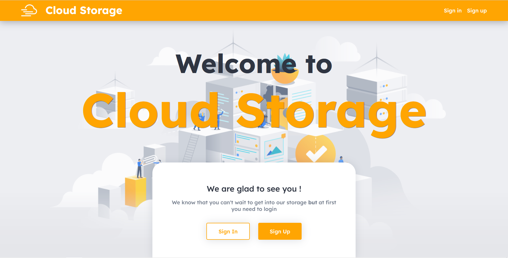
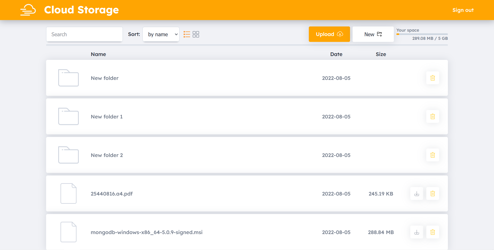
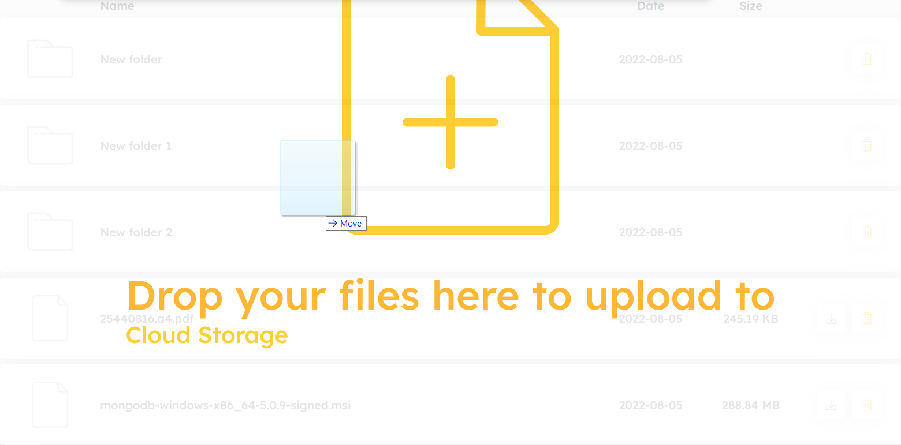
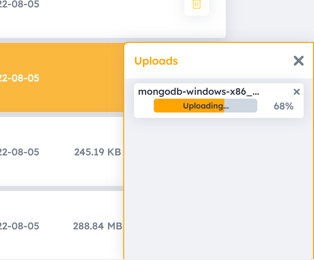

# Cloud Storage Website

This web application is a complete service. This service provides cloud storage of data and private access to them.

***
# How it works

The principle of operation is simple. You log in and get a small amount of free space in the cloud.

## Here some main functions
>**Files operations**
> * Create new folder
> * Upload file / files
> * Upload by drag and drop
> * Delete file / files / folder
> * Download file
>
>**Ways of presenting information** 
> * Search
> * Sort by name / type / date
> * File list view type
> * Display remaining storage space

## Uploading by drag and drop
This method is used to more conveniently upload files to storage.

## Uploading
As for the upload process. During the upload process, a pop-up window appears with the upload progress. Thus, the user will have full control over the upload of the necessary files to the storage. And also the user will know if his file has loaded or if a network error has occurred
it

***
## Available Scripts

In the project directory, you can run:

### `npm start`

Runs the app in the development mode.\
Open [http://localhost:3000](http://localhost:3000) to view it in your browser.

The page will reload when you make changes.\
You may also see any lint errors in the console.

### `npm test`

Launches the test runner in the interactive watch mode.\
See the section about [running tests](https://facebook.github.io/create-react-app/docs/running-tests) for more information.

### `npm run build`

Builds the app for production to the `build` folder.\
It correctly bundles React in production mode and optimizes the build for the best performance.

The build is minified and the filenames include the hashes.\
Your app is ready to be deployed!

See the section about [deployment](https://facebook.github.io/create-react-app/docs/deployment) for more information.

### `npm run eject`

**Note: this is a one-way operation. Once you `eject`, you can't go back!**

If you aren't satisfied with the build tool and configuration choices, you can `eject` at any time. This command will remove the single build dependency from your project.

Instead, it will copy all the configuration files and the transitive dependencies (webpack, Babel, ESLint, etc) right into your project so you have full control over them. All of the commands except `eject` will still work, but they will point to the copied scripts so you can tweak them. At this point you're on your own.

You don't have to ever use `eject`. The curated feature set is suitable for small and middle deployments, and you shouldn't feel obligated to use this feature. However we understand that this tool wouldn't be useful if you couldn't customize it when you are ready for it.
